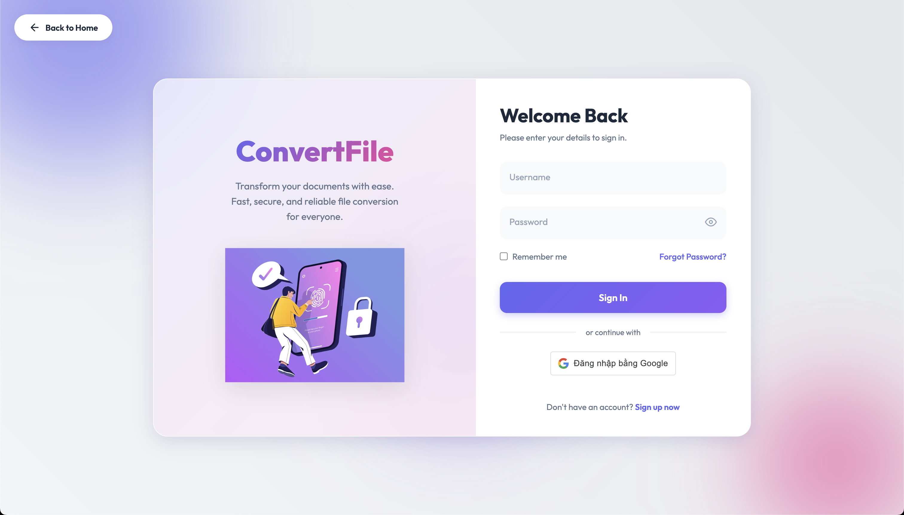
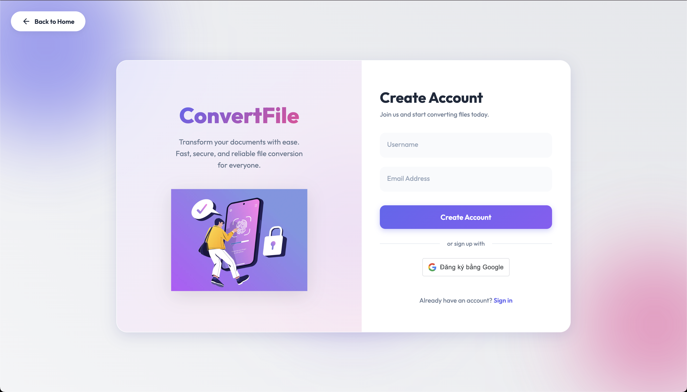
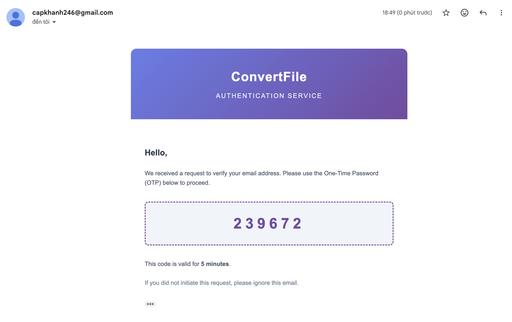
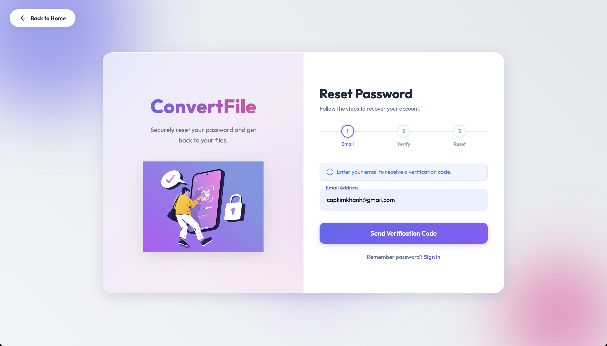
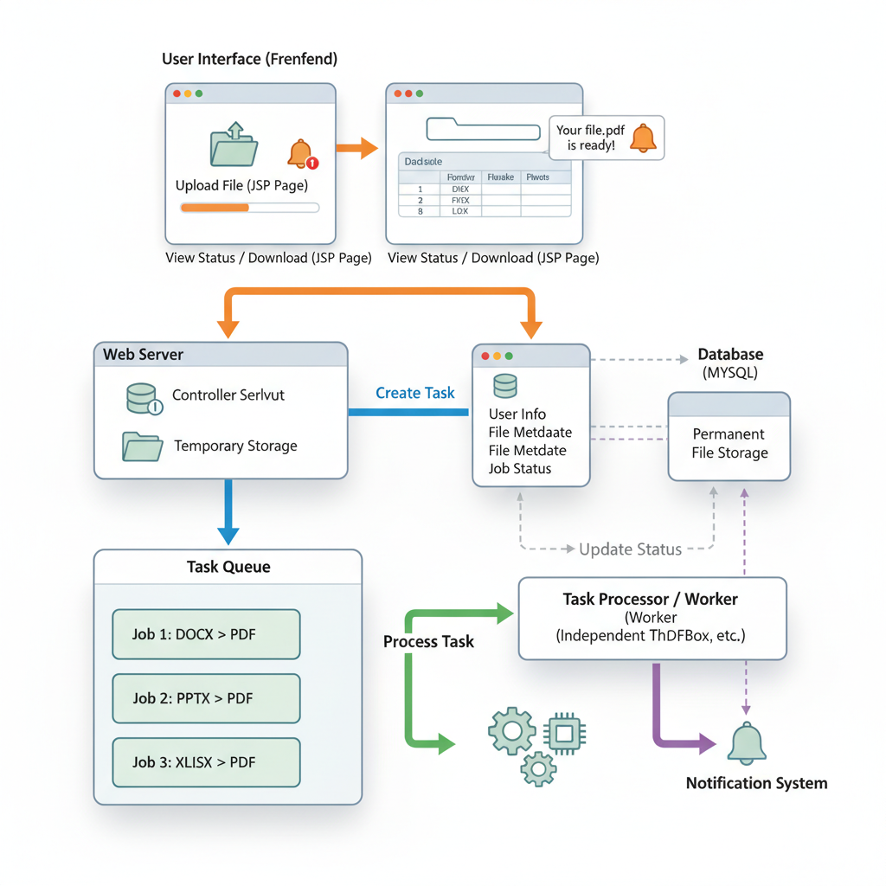
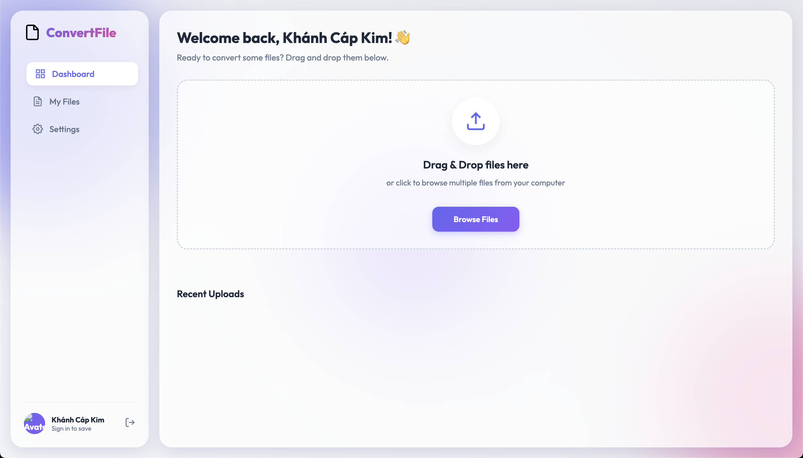
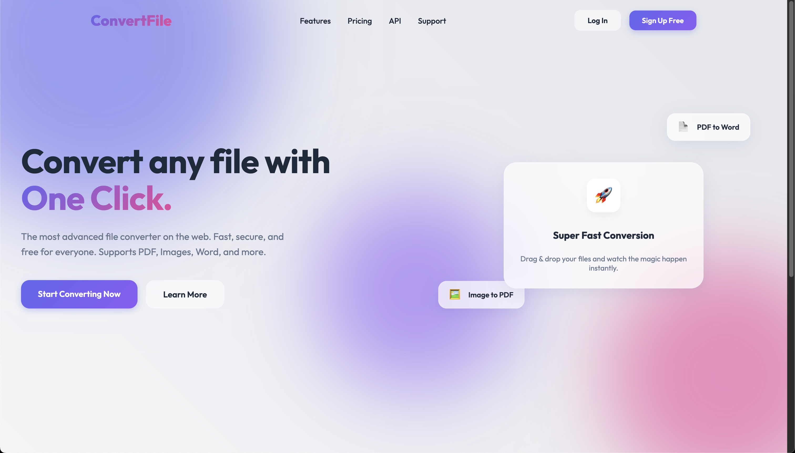
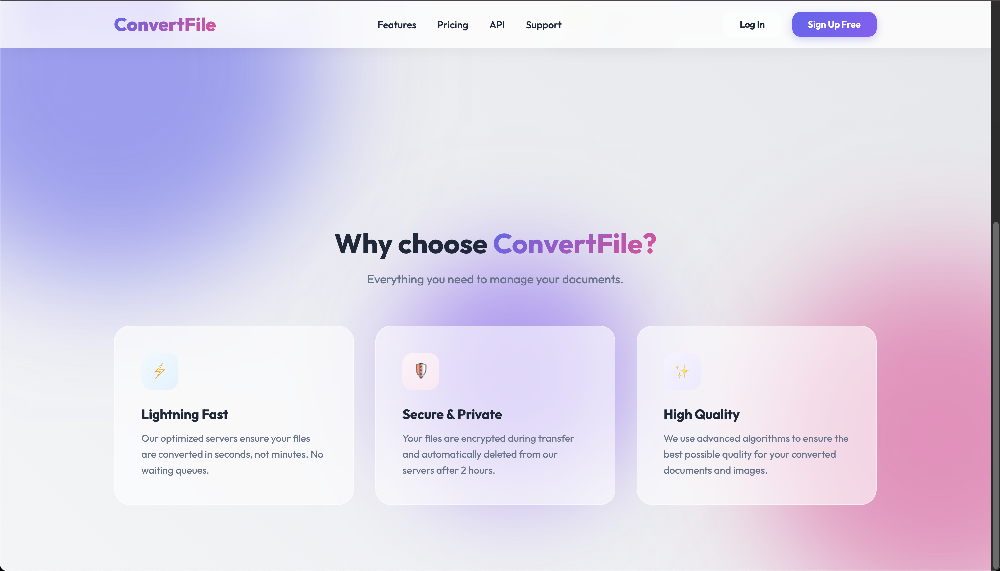

# 📂 CONVERT_FILE - Professional File Conversion System


> **A robust, scalable, and secure web application for converting files between various formats.**  
> *Built with Java Servlet, RabbitMQ, and Cloudinary.*

---

## 📖 Table of Contents
- [✨ Introduction](#-introduction)
- [📸 Application Screenshots](#-application-screenshots)
- [🚀 Key Features](#-key-features)
- [🛠️ Technology Stack](#-technology-stack)
- [⚙️ System Architecture](#-system-architecture)
- [📥 Installation & Setup](#-installation--setup)
- [🤝 Contributing](#-contributing)

---

## ✨ Introduction

**CONVERT_FILE** is an enterprise-grade file conversion platform designed to handle high-volume document processing. It leverages a microservices-inspired architecture where the web frontend is decoupled from the heavy processing workers via **RabbitMQ** and **Redis**.

Whether you need to convert **PDF to Word**, **Images to PDF**, or **Excel to CSV**, CONVERT_FILE provides a seamless and fast experience with real-time progress updates.

---

## 📸 Application Screenshots

### 🔐 Authentication & Security
Secure user access with OTP verification and password recovery.

| **Login** | **Registration** |
|:---:|:---:|
|  |  |

| **OTP Verification** | **Forgot Password Flow** |
|:---:|:---:|
|  |  |

### 🖥️ Main Interface
A clean, modern dashboard for managing your files and conversions.

| **Dashboard Overview** | **File Management** |
|:---:|:---:|
|  |  |

| **Conversion Interface** | **Process Flow** |
|:---:|:---:|
|  |  |

---

## 🚀 Key Features

-   **🔄 Multi-Format Conversion**: Support for PDF, DOCX, XLSX, CSV, XML, JSON, and Image formats.
-   **⚡ Asynchronous Processing**: Heavy tasks are offloaded to background workers via **RabbitMQ**, ensuring the UI remains responsive.
-   **📡 Real-Time Updates**: **Redis Pub/Sub** and **WebSockets** provide live progress bars and status notifications.
-   **☁️ Cloud Storage**: Secure file storage and delivery using **Cloudinary**.
-   **🛡️ Security**:
    -   BCrypt password hashing.
    -   OTP-based email verification (Registration & Password Reset).
    -   Session management and XSS protection.
-   **🧹 Auto-Cleanup**: Automated scheduling to clean up old files and temporary data.

---

## 🛠️ Technology Stack

| Component | Technology |
| :--- | :--- |
| **Backend Core** | Java Servlet, JSP, JSTL |
| **Database** | MySQL (HikariCP Connection Pool) |
| **Message Queue** | RabbitMQ (AMQP) |
| **Caching/PubSub** | Redis (Jedis) |
| **Storage** | Cloudinary API |
| **Frontend** | HTML5, CSS3, JavaScript, Bootstrap |
| **Build Tool** | Apache Maven |
| **Server** | Apache Tomcat 10+ |

---

## ⚙️ System Architecture

1.  **Web Server (Tomcat)**: Handles HTTP requests, authentication, and file uploads.
2.  **Producer**: Pushes conversion tasks to a **RabbitMQ** queue.
3.  **Worker Pool**: Consumes tasks from the queue, performs the conversion (using libraries like PDFBox, POI), and uploads results to Cloudinary.
4.  **Notifier**: Updates task status in **MySQL** and publishes progress to **Redis**.
5.  **Client**: Receives real-time updates via WebSockets subscribed to Redis channels.

---

## 📥 Installation & Setup

### Prerequisites
-   Java JDK 21+
-   MySQL 8.0+
-   RabbitMQ Server
-   Redis Server
-   Apache Maven

### 1. Database Setup
Execute the initialization script to create the schema and default users:
```sql
source src/main/java/com/convertfile/model/bean/BD_Query.sql
```

### 2. Configuration
Update `src/main/resources/application.properties` with your credentials:
```properties
# Database
database.url=jdbc:mysql://127.0.0.1:3306/file_converter
database.username=your_user
database.password=your_password

# RabbitMQ
rabbitmq.host=localhost
rabbitmq.username=guest
rabbitmq.password=guest

# Cloudinary
cloudinary.cloud.name=your_cloud_name
cloudinary.api.key=your_api_key
cloudinary.api.secret=your_api_secret

# Email Service
email.username=your_email@gmail.com
email.password=your_app_password
```

### 3. Build & Run
```bash
# Build the WAR file
mvn clean package

# Run with the provided script (Mac/Linux)
./run.sh
```

### 4. Access
Open your browser and navigate to:
`http://localhost:8080/CONVERT_FILE/`

---

## 🤝 Contributing

We welcome contributions! Please follow these steps:
1.  Fork the repository.
2.  Create a feature branch (`git checkout -b feature/AmazingFeature`).
3.  Commit your changes (`git commit -m 'Add some AmazingFeature'`).
4.  Push to the branch (`git push origin feature/AmazingFeature`).
5.  Open a Pull Request.

---

<div align="center">
  <b>Developed by Cap Kim Khanh & Team</b><br>
  &copy; 2025 CONVERT_FILE. All rights reserved.
</div>
